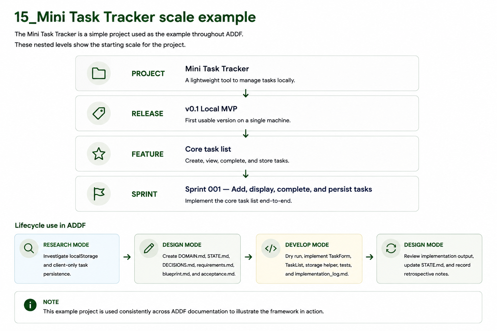
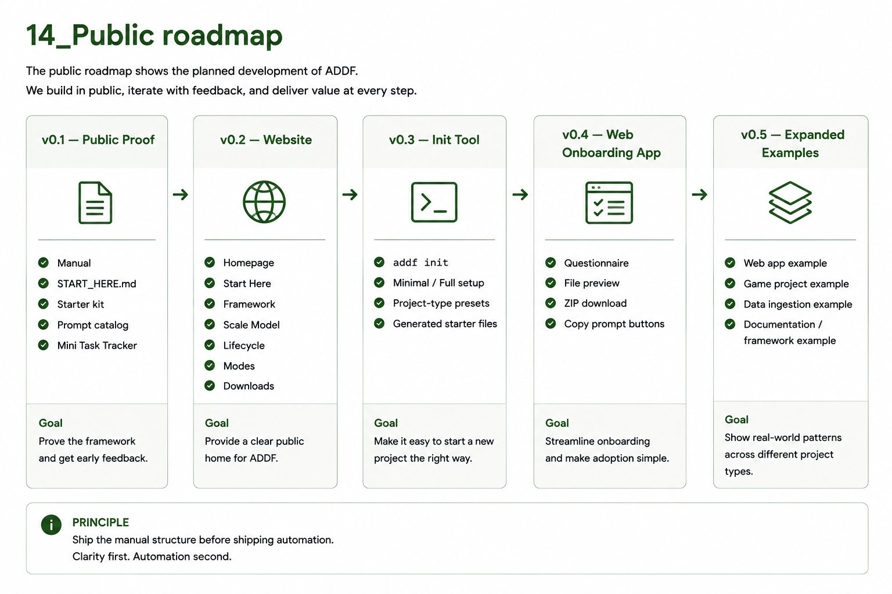

# Examples

Two worked examples showing ADDF in practice — the Mini Task Tracker and the ADDF public repository.

## Table of contents

1. [Mini Task Tracker](#mini-task-tracker)
2. [ADDF public repository](#addf-public-repository)

---

## Mini Task Tracker

The Mini Task Tracker is a local-only, single-user task management app. It is the canonical small example — chosen because it is bounded enough to show every framework step without the example itself becoming a distraction.

### Work scale breakdown

```
Project:  Mini Task Tracker
Release:  v0.1 Local MVP
Feature:  Core task list
Sprint:   Sprint 001 — Add, display, complete, and persist tasks
```

### Lifecycle use

**Research Mode** investigated localStorage and client-only task persistence — the question being whether browser storage was sufficient for the v0.1 scope.

**Design Mode** produced `DOMAIN.md`, `STATE.md`, `DECISIONS.md`, `requirements.md`, `blueprint.md`, and `acceptance.md` from the research output and the project goal.

**Develop Mode** ran a Dry Run, then implemented `TaskForm`, `TaskList`, a storage helper, tests, and `implementation_log.md` after approval.

**Design Mode** returned after implementation to review the output against acceptance criteria, update `STATE.md`, and write retrospective notes.

### Example DOMAIN.md

```md
# DOMAIN.md

## Project Overview
Mini Task Tracker is a local-only task management app for a single user.

## Core Entities

### Task
Definition: A single item the user wants to complete.
Key fields: id, title, status, createdAt, completedAt.
Business rules:
- A task title cannot be empty.
- A completed task can be reopened.
- Tasks are stored in browser localStorage.
What it is NOT:
- A shared task
- A cloud record
- A calendar event
- A reminder

## Workflows

### Add a Task
1. User types a title.
2. User submits.
3. Task is created with active status.
4. Task is saved to localStorage.

Edge case:
If the title is empty or whitespace-only, reject submission.

## Out of Scope
- User accounts
- Cloud sync
- Notifications
- Collaboration
```



**Rule:** Small examples stay small. The point is to expose the process, not showcase an app.

---

## ADDF public repository

The public ADDF repository uses the framework to build itself — every sprint, every decision, and every file follows ADDF protocol.

### Project scope

The public repository includes:

- documentation (this wiki),
- website,
- starter kit,
- prompt catalog,
- example project,
- download packages,
- optional CLI init tool,
- optional web onboarding app.

### Release plan summary

**v0.1 Public Proof** — `README.md`, `START_HERE.md`, full manual Markdown and PDF, `starter-kit/blank`, `starter-kit/example-filled`, `examples/mini-task-tracker`, `prompts/`, logo assets, lifecycle image.

**v0.2 Website MVP** — static website with homepage, Start Here page, lifecycle page, modes page, and downloads page.

**v0.3 Init Tool Prototype** — `addf init` command with minimal/full setup modes, project-type presets, and generated starter files.

**v0.4 Web Onboarding App** — browser questionnaire, generated file preview, download starter ZIP, and copy-prompt buttons.

### Sprint 001

Goal: Normalize repository structure and starter kit so the repo becomes the official ADDF project home.

In scope: organize docs, create starter-kit folders, create prompt folders, create planning structure, create example placeholders, create `README.md` and `START_HERE.md` if missing.

Out of scope: website implementation, CLI implementation, backend, package publishing, final branding.



**Rule:** The public repository must dogfood the framework.

---

[← Wiki Home](index.md) · ADDF v3.5
