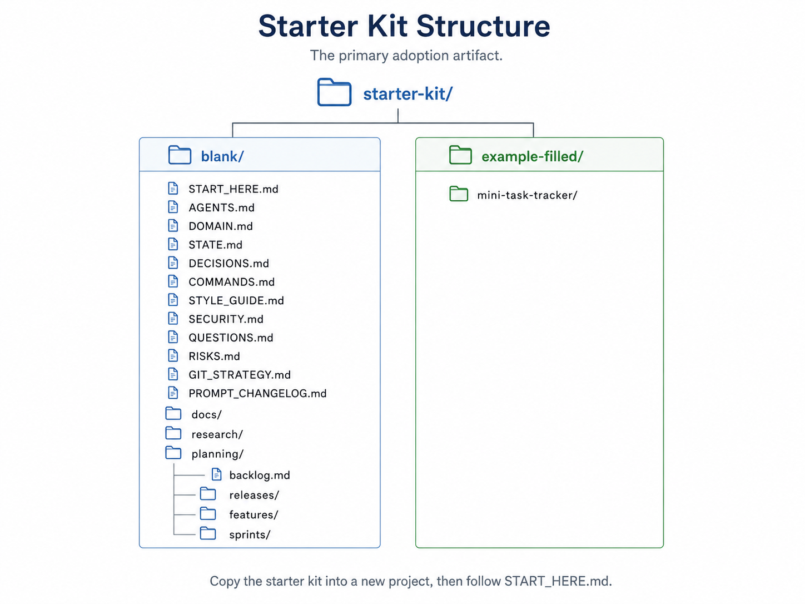
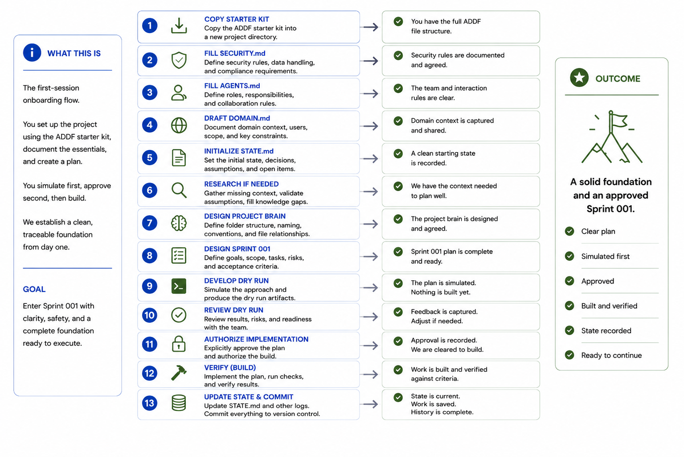

# Getting Started

In the first 20 minutes: create the folder structure, fill `SECURITY.md`, populate the core files in order, and run your first session in the right mode sequence.

## Table of contents

1. [What you need](#what-you-need)
2. [Step 1 — Copy the starter kit](#step-1--copy-the-starter-kit)
3. [Step 2 — Fill SECURITY.md first](#step-2--fill-securitymd-first)
4. [Step 3 — Populate the core files in order](#step-3--populate-the-core-files-in-order)
5. [Step 4 — Your first session](#step-4--your-first-session)
6. [What comes next](#what-comes-next)

---

## What you need

ADDF has no required tools beyond what any developer already has:

- any capable LLM (Claude, GPT-4, Gemini, or equivalent),
- a text editor,
- a terminal,
- and a git repository.

No plugin, extension, agent, or platform subscription is required. The framework is a set of files and a protocol for using them.

---

## Step 1 — Copy the starter kit

Create the standard folder structure with one bash block. Run this from the root of your new project:

```bash
mkdir -p src docs research planning/sprints/sprint_001
touch AGENTS.md DOMAIN.md STATE.md DECISIONS.md COMMANDS.md \
      STYLE_GUIDE.md SECURITY.md QUESTIONS.md RISKS.md \
      GIT_STRATEGY.md PROMPT_CHANGELOG.md
touch planning/backlog.md
touch planning/sprints/sprint_001/requirements.md \
      planning/sprints/sprint_001/blueprint.md \
      planning/sprints/sprint_001/acceptance.md \
      planning/sprints/sprint_001/dry_run.md \
      planning/sprints/sprint_001/implementation_log.md \
      planning/sprints/sprint_001/human_review.md \
      planning/sprints/sprint_001/retrospective.md
```

What this creates:

- the core project brain files at the root,
- a `docs/` folder for architecture documentation,
- a `research/` folder for Research Mode output,
- a `planning/` folder containing `backlog.md` and the first sprint subfolder,
- and a `src/` folder where Develop Mode writes code.



**Rule:** The folder structure should make the operating model visible.

---

## Step 2 — Fill SECURITY.md first

`SECURITY.md` defines what is and is not safe to load into an AI session. Everything else you create after this may be sent to a model. Set the boundary before writing anything that contains credentials, PII, or confidential logic.

A minimal `SECURITY.md` contains two lists:

```md
# SECURITY.md

## Safe to load into AI sessions
- AGENTS.md
- DOMAIN.md
- STATE.md
- DECISIONS.md
- COMMANDS.md
- QUESTIONS.md
- RISKS.md
- sprint files

## Never load into AI sessions
- .env
- secrets/
- [any file containing credentials, API keys, or PII]
```

Fill the "never load" list for your project before populating any other file.

**Rule:** Fill `SECURITY.md` before loading files into an AI session.

---

## Step 3 — Populate the core files in order

The core files form a dependency chain. Fill them in this sequence so each file can reference the one before it:

1. `SECURITY.md` — boundaries (done in Step 2)
2. `AGENTS.md` — mode rules, permissions, session constraints
3. `DOMAIN.md` — business logic, entities, workflows, boundaries
4. `STATE.md` — current goal, scale, mode, sprint, blockers, next action
5. `COMMANDS.md` — run, test, build, deploy, rollback commands
6. `DECISIONS.md` — architecture and dependency decisions
7. `QUESTIONS.md` — unknowns and blockers
8. `RISKS.md` — known risks and mitigation

You do not need these files to be complete before starting a session. A minimal `AGENTS.md` and a stub `DOMAIN.md` are enough to begin. Fill them progressively as Research Mode and Design Mode run.

See [File Reference](file-reference.md) for the full template for each file.

**Rule:** If a model needs to know it later, write it to the project brain.

---

## Step 4 — Your first session

A new project starts with this mode sequence:

```
Research Mode     — if meaningful unknowns exist
Design Mode       — to generate project memory from research and intent
Design Mode       — to generate the first Sprint Pack
Develop Mode      — to produce a dry run
Develop Mode      — to implement after dry run approval
Design Mode       — to review output and update state
```

Open your LLM of choice. Load the files appropriate to the current mode — `AGENTS.md` is always loaded first. Declare the mode at the top of the session. Use the prompts from the [Prompt Catalog](prompt-catalog.md) to structure each session.



**Rule:** Declare the mode before the model acts.

---

## What comes next

Once your first sprint is complete:

- [Lifecycle](lifecycle/index.md) — understand the full 8-step delivery path and how it scales
- [Sprint Loop](sprint-loop.md) — the 11-step controlled implementation workflow for every sprint
- [Prompt Catalog](prompt-catalog.md) — copy-paste prompts for every mode and workflow
- [Core Concepts](core-concepts.md) — the four separations and six principles that explain why the framework works

---

[← Wiki Home](index.md) · ADDF v3.5
