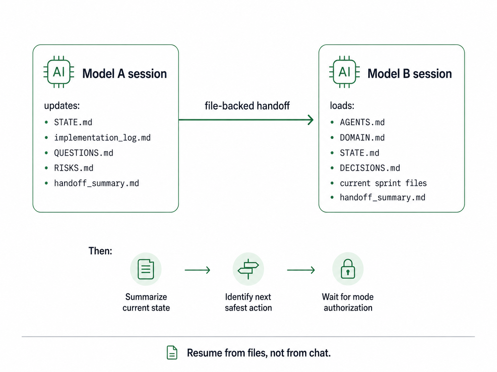

# Handoff, Resumption & Model Switching

ADDF treats model handoff as a normal operating condition — a new model resumes from files, not from memory.

## Table of contents

1. [Session checkpoint protocol](#session-checkpoint-protocol)
2. [Handoff summary template](#handoff-summary-template)
3. [Incoming model protocol](#incoming-model-protocol)
4. [The resumption prompt](#the-resumption-prompt)

---

## Session checkpoint protocol

Before ending a session, switching models, or approaching context limits, the active AI must update or produce these files:

```
STATE.md
implementation_log.md   — if in Develop Mode
QUESTIONS.md
RISKS.md
planning/backlog.md
retrospective.md        — if appropriate
handoff_summary.md
```

The checkpoint does not require the session to be finished. A mid-sprint checkpoint is valid. The point is that the next session — whether opened one minute later or one month later, by the same model or a different one — can resume from files without requiring any prior chat history.

**Rule:** If the work matters, it leaves a file trail.

---

## Handoff summary template

`handoff_summary.md` is the bridge document between sessions. It captures everything the next model or human needs to orient quickly.

```md
# Handoff Summary

## Current Goal
[Current objective]

## Current Mode
[Research / Design / Develop]

## Active Scale
[Project / Release / Feature / Sprint / Patch]

## Active Release
[Version or "None"]

## Active Feature
[Feature or "None"]

## Active Sprint
[Sprint or "None"]

## Completed Work
[Completed items]

## Files Changed
- [File path]: [Change summary]

## Commands Run
- [Command]: [Result]

## Current Problems
[Errors, blockers, failed checks]

## Unfinished Work
[Remaining work]

## Next Recommended Action
[Next safest action]

## Warnings
[Risks, assumptions, caveats]
```

---

## Incoming model protocol

When a new model session opens after a handoff or resumption, it loads:

```
AGENTS.md
DOMAIN.md
STATE.md
COMMANDS.md
DECISIONS.md
QUESTIONS.md
RISKS.md
current requirements.md
current blueprint.md
current acceptance.md
current dry_run.md
current implementation_log.md
handoff_summary.md
```

After loading, the model summarizes current state and waits for explicit mode authorization before changing any file. It does not assume the previous session's mode carries over.

**Rule:** The next model resumes from files, not from memory.

---

## The resumption prompt

After the incoming model loads the files above, send the Resumption Prompt to orient it:

```
You are operating in Design Mode for resumption.

Loaded:
- AGENTS.md
- DOMAIN.md
- STATE.md
- DECISIONS.md
- QUESTIONS.md
- RISKS.md
- backlog
- current sprint or release files if present

Summarize:
1. Project purpose
2. Active scale
3. Current mode
4. Active release / feature / sprint
5. Last completed step
6. Known blockers
7. Next safest action
8. Files to load before Develop Mode
```

The full prompt catalog — including all mode-open prompts — is at [Prompt Catalog](prompt-catalog.md).



---

[← Wiki Home](index.md) · ADDF v3.5
