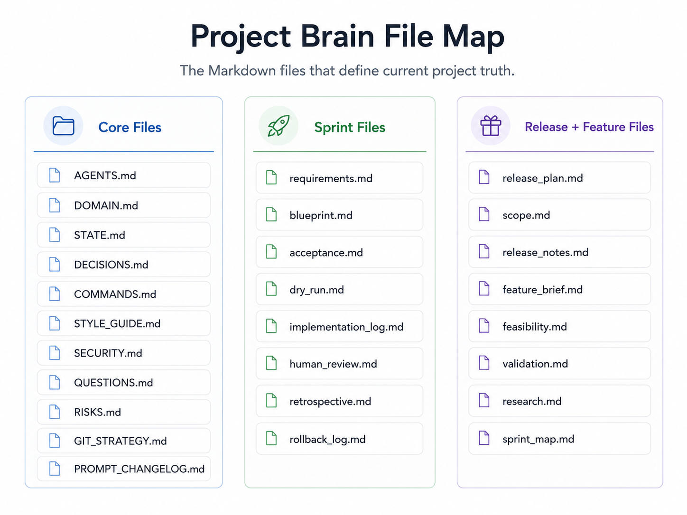

# The Project Brain

The Project Brain is the file-backed memory layer — it must be current, explicit, scoped, reviewable, searchable, versioned, and safe to load into an LLM session.

## Table of contents

1. [Core files](#core-files)
2. [Sprint files](#sprint-files)
3. [Release and feature files](#release-and-feature-files)
4. [Properties of good project memory](#properties-of-good-project-memory)
5. [File responsibilities](#file-responsibilities)

---

## Core files

The core files are loaded into every AI session that requires project context. They define the operating rules, domain, current state, and key decisions.

```
AGENTS.md
DOMAIN.md
STATE.md
DECISIONS.md
COMMANDS.md
STYLE_GUIDE.md
SECURITY.md
QUESTIONS.md
RISKS.md
GIT_STRATEGY.md
PROMPT_CHANGELOG.md
```

`AGENTS.md` is always loaded first — it establishes the mode rules and permission constraints for the session.

---

## Sprint files

Sprint files are scoped to a single sprint folder under `planning/sprints/sprint_NNN/`. They document what was planned, what was built, and what was learned.

```
requirements.md
blueprint.md
acceptance.md
dry_run.md
implementation_log.md
human_review.md
retrospective.md
rollback_log.md
```

---

## Release and feature files

Release and feature files live under their respective folders in `planning/`. They bridge the gap between project-level decisions and sprint-level implementation.

```
release_plan.md
scope.md
release_notes.md
feature_brief.md
feasibility.md
validation.md
research.md
sprint_map.md
```

---

## Properties of good project memory

The project brain has seven properties that make it reliable across sessions and model switches:

1. **Current** — reflects the latest decisions, state, and sprint outcomes. Stale memory is worse than no memory.
2. **Explicit** — leaves nothing implicit. Rules, scope, entities, and constraints are written down.
3. **Scoped** — each file covers one concern. `DOMAIN.md` is not `STATE.md`. `blueprint.md` is not `requirements.md`.
4. **Reviewable** — every file can be diffed, committed, and audited by a human.
5. **Searchable** — headings and structure are consistent so a model can find the relevant section quickly.
6. **Versioned** — files live in the repository and are tracked in git like any other source file.
7. **Safe to load** — `SECURITY.md` defines the safe-to-load boundary. Nothing outside it goes into a session.

**Rule:** If a model needs to know it later, write it to the project brain.

---

## File responsibilities

| File | Responsibility |
|---|---|
| `AGENTS.md` | Mode rules, permissions, session constraints. |
| `DOMAIN.md` | Business logic, entities, workflows, boundaries. |
| `STATE.md` | Current goal, scale, mode, release, sprint, blockers, next action. |
| `DECISIONS.md` | Durable architecture and dependency decisions. |
| `COMMANDS.md` | Run, test, build, deploy, and rollback commands. |
| `SECURITY.md` | Safe-to-load and never-load rules. |
| `QUESTIONS.md` | Unknowns and blockers. |
| `RISKS.md` | Known risks and mitigation. |
| `requirements.md` | What the sprint must accomplish. |
| `blueprint.md` | How the sprint will be implemented. |
| `acceptance.md` | What counts as done. |
| `dry_run.md` | What Develop Mode intends to change. |
| `implementation_log.md` | What Develop Mode changed and verified. |
| `human_review.md` | Human approval record. |
| `retrospective.md` | Lessons and constraints from the sprint. |

For full templates for each file, see [File Reference](file-reference.md).



---

[← Wiki Home](index.md) · ADDF v3.5
