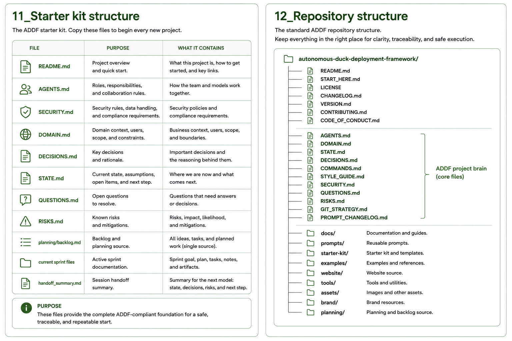

# Repository Structure

A well-structured ADDF repository makes the operating model visible from the folder tree alone.

## Table of contents

1. [Standard ADDF project](#standard-addf-project)
2. [Minimum viable ADDF](#minimum-viable-addf)
3. [Public ADDF repository](#public-addf-repository)

---

## Standard ADDF project

The standard layout for a project using ADDF. Every folder has a defined purpose in the framework's operation.

```
Project-Root/
├── AGENTS.md               ← Mode rules, permissions, session constraints
├── DOMAIN.md               ← Business logic, entities, workflows
├── STATE.md                ← Current goal, mode, sprint, blockers
├── DECISIONS.md            ← Architecture and dependency decisions
├── COMMANDS.md             ← Run, test, build, deploy, rollback commands
├── STYLE_GUIDE.md          ← Code and design style rules
├── SECURITY.md             ← Safe-to-load and never-load rules
├── QUESTIONS.md            ← Unknowns and blockers
├── RISKS.md                ← Known risks and mitigation
├── GIT_STRATEGY.md         ← Branch and commit conventions
├── PROMPT_CHANGELOG.md     ← Record of prompt changes
├── README.md
├── .gitignore
├── docs/
│   ├── architecture.md
│   ├── data_model.md
│   ├── api.md
│   ├── permissions.md
│   └── validation.md
├── research/
│   ├── notes.md
│   ├── sources.md
│   └── open_questions.md
├── planning/
│   ├── backlog.md
│   ├── releases/
│   ├── features/
│   └── sprints/
├── prompts/
│   ├── research/
│   ├── design/
│   └── develop/
└── src/                    ← Develop Mode writes here
```



**Rule:** The folder structure should make the operating model visible.

---

## Minimum viable ADDF

The smallest set of files and folders that gives a project meaningful ADDF scaffolding. Use this when starting a very small project or when stripping down to essentials.

```
Project-Root/
├── AGENTS.md
├── DOMAIN.md
├── STATE.md
├── COMMANDS.md
├── SECURITY.md
├── planning/
│   ├── backlog.md
│   └── sprints/
│       └── sprint_001/
│           ├── requirements.md
│           ├── blueprint.md
│           ├── acceptance.md
│           ├── dry_run.md
│           ├── implementation_log.md
│           ├── human_review.md
│           └── retrospective.md
└── src/
```

This configuration supports a single sprint loop. Add `DECISIONS.md`, `QUESTIONS.md`, `RISKS.md`, and `planning/releases/` as the project grows.

---

## Public ADDF repository

The structure for the ADDF framework's own public repository — the one that ships the starter kit, prompt catalog, examples, and optional tooling. This repo uses ADDF to build ADDF.

```
autonomous-duck-deployment-framework/
├── README.md
├── START_HERE.md
├── LICENSE
├── CHANGELOG.md
├── VERSION.md
├── CONTRIBUTING.md
├── AGENTS.md
├── DOMAIN.md
├── STATE.md
├── DECISIONS.md
├── COMMANDS.md
├── STYLE_GUIDE.md
├── SECURITY.md
├── QUESTIONS.md
├── RISKS.md
├── docs/
├── starter-kit/
│   ├── blank/
│   └── example-filled/
├── prompts/
│   ├── research/
│   ├── design/
│   └── develop/
├── examples/
├── website/
├── assets/
├── brand/
├── tools/
└── planning/
```

**Rule:** The public repository must dogfood the framework.

See [Initial Setup](initial-setup.md) for the bash commands that create the standard project structure, and [Getting Started](getting-started.md) for the first-session walkthrough.

---

[← Wiki Home](index.md) · ADDF v3.5
