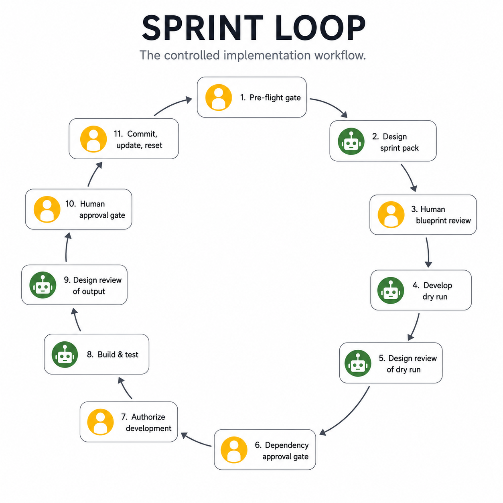

# Sprint Loop

The Sprint Loop is the controlled 11-step implementation workflow — from pre-flight gate through commit, state update, and session reset.

## Table of contents

1. [Overview](#overview)
2. [Step 1 — Pre-flight gate](#step-1--pre-flight-gate)
3. [Step 2 — Design sprint pack](#step-2--design-sprint-pack)
4. [Step 3 — Human blueprint review](#step-3--human-blueprint-review)
5. [Step 4 — Develop dry run](#step-4--develop-dry-run)
6. [Step 5 — Design review of dry run](#step-5--design-review-of-dry-run)
7. [Step 6 — Dependency approval gate](#step-6--dependency-approval-gate)
8. [Step 7 — Authorize development](#step-7--authorize-development)
9. [Step 8 — Build & test](#step-8--build--test)
10. [Step 9 — Design review of output](#step-9--design-review-of-output)
11. [Step 10 — Human approval gate](#step-10--human-approval-gate)
12. [Step 11 — Commit, update, reset](#step-11--commit-update-reset)

---

## Overview

```
1.  Pre-flight gate
2.  Design sprint pack
3.  Human blueprint review
4.  Develop dry run
5.  Design review of dry run
6.  Dependency approval gate
7.  Authorize development
8.  Build & test
9.  Design review of output
10. Human approval gate
11. Commit, update, reset
```

Use the Sprint Loop for any bounded work that requires a plan, Dry Run, implementation, verification, and review. For very small changes, see [Work Scale Model](work-scale.md) — a patch may not need the full loop.



---

## Step 1 — Pre-flight gate

The human checks readiness before any session opens:

- scale is identified,
- blockers are absent or documented,
- risks are reviewed,
- the correct branch is created,
- the relevant release or feature is clear,
- and scope is specific enough to write requirements.

No model session opens until the pre-flight check passes.

---

## Step 2 — Design sprint pack

Design Mode generates the Sprint Pack:

```
requirements.md
blueprint.md
acceptance.md
```

Files to load: `AGENTS.md`, `DOMAIN.md`, `STATE.md`, `DECISIONS.md`, `QUESTIONS.md`, `RISKS.md`.

Use the Sprint Pack generation prompt from the [Prompt Catalog](prompt-catalog.md).

**Rule:** The Sprint Pack is the contract for Develop Mode.

---

## Step 3 — Human blueprint review

The human validates the Sprint Pack before any implementation work begins. The review checks:

- desired outcome matches intent,
- domain alignment — does the blueprint match `DOMAIN.md`?
- file scope is appropriate,
- assumptions are explicit and acceptable,
- acceptance criteria are testable,
- and out-of-scope items are named.

Return the Sprint Pack to Design Mode for corrections if any check fails.

---

## Step 4 — Develop dry run

Develop Mode opens at Permission Level 0 and produces `dry_run.md`.

The Dry Run lists every file the model intends to create, modify, move, or delete — plus commands, dependencies, risks, and ambiguities. Then the model stops.

No code is written in this step.

---

## Step 5 — Design review of dry run

Design Mode compares the Dry Run against the Sprint Pack:

- `requirements.md` vs `dry_run.md` — does the dry run address all requirements?
- `blueprint.md` vs `dry_run.md` — does the dry run stay within the blueprint scope?
- `acceptance.md` vs `dry_run.md` — are the acceptance criteria achievable with the proposed changes?

Design Mode returns one of: Approved, Not Approved (with required corrections), or Approved at a specific Permission Level.

---

## Step 6 — Dependency approval gate

Any new dependency named in `dry_run.md` requires a `DECISIONS.md` entry before implementation proceeds.

The entry records the dependency name, the reason for adding it, and any tradeoffs. This step is skipped if the Dry Run requests no new dependencies.

---

## Step 7 — Authorize development

The human writes the authorization message and sends it to the Develop Mode session:

```
Dry run approved.
Permission Level [LEVEL] authorized.
Proceed according to requirements.md, blueprint.md, acceptance.md, and dry_run.md.
```

Replace `[LEVEL]` with the appropriate level from the [Permission Levels](permission-levels.md) page. Most sprints proceed at Level 1.

**Rule:** Develop Mode does not self-authorize.

---

## Step 8 — Build & test

Develop Mode implements approved work and logs:

```
implementation_log.md
test output
errors
handoff notes
```

Develop Mode modifies only the files listed in `blueprint.md` and `dry_run.md`. It runs verification commands and pastes raw output into `implementation_log.md`. It stops immediately if ambiguity appears.

---

## Step 9 — Design review of output

Design Mode reviews the implementation against:

- the Sprint Pack (requirements, blueprint, acceptance criteria),
- `implementation_log.md`,
- and the files that were changed.

Design Mode returns an assessment: passes review, has issues requiring action, or has blocking failures.

---

## Step 10 — Human approval gate

The human checks:

- scope — did implementation stay within the approved file list?
- verification — did all verification commands pass?
- documentation — are logs and implementation notes complete?
- security — did implementation touch any file outside `SECURITY.md` safe-to-load rules?
- state — is `STATE.md` ready to be updated?
- decisions — does `DECISIONS.md` need new entries?
- handoff readiness — if pausing, does a handoff summary exist?

If any check fails, the sprint stays open.

---

## Step 11 — Commit, update, reset

The human:

1. commits the approved implementation on the active branch,
2. updates `STATE.md`, `DECISIONS.md`, `planning/backlog.md`,
3. marks `retrospective.md` complete,
4. and closes or checkpoints the active AI session.

**Rule:** A sprint ends when state is updated, not when code compiles.

---

[← Wiki Home](index.md) · ADDF v3.5
