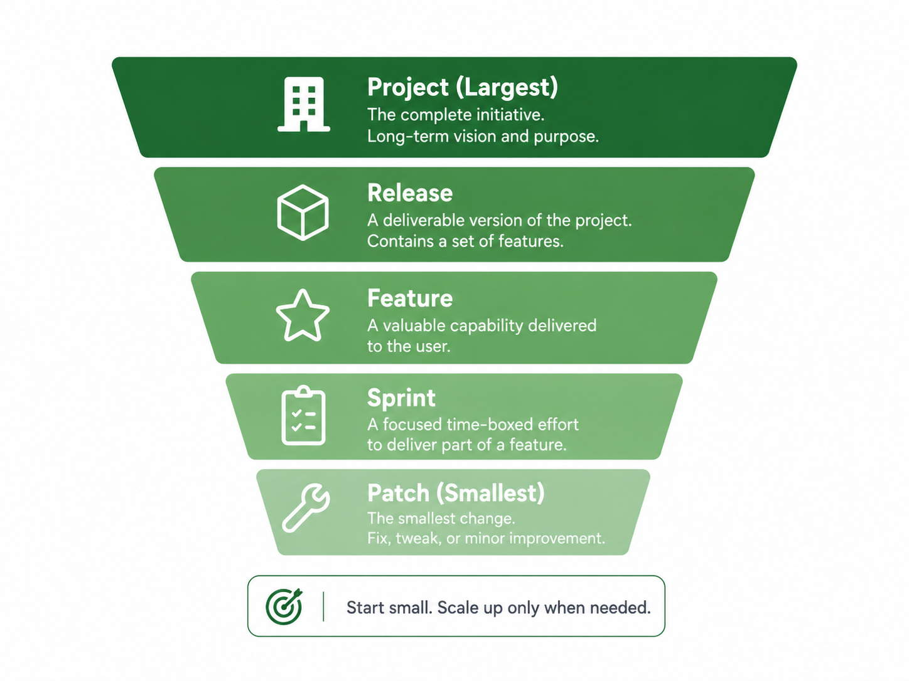

# Work Scale Model

Scale determines how much process is appropriate — a patch and a new project must not follow the same workflow.

## Table of contents

1. [The five scales](#the-five-scales)
2. [Scale-to-process mapping](#scale-to-process-mapping)

---

## The five scales

### Project

A **Project** is the full product or initiative. It is the highest scale.

Examples:

```
ADDF public website and starter kit
Mini Task Tracker
Unity training simulation
Local politics education site
Data ingestion pipeline
```

Project-level work uses the full lifecycle: Research, Design & Feasibility, Validation Gate, Architecture, Sprint Planning, Build & Test, Review & Reflection, and Deploy/Maintain/Resume.

**Rule:** Scale controls process depth.

---

### Release

A **Release** is a versioned delivery target — a bounded set of features grouped into one shippable unit.

Examples:

```
v0.1 Public Proof
v0.2 Website MVP
v0.3 CLI Init Tool
v1.0 Stable Release
v2.0 Major Update
```

A completed release becomes the baseline for the next. The project brain persists across release boundaries. See [Release Cycles](release-cycles.md) for the full protocol.

**Rule:** A new release updates the project brain. It does not restart the project from zero.

---

### Feature

A **Feature** is a user-visible or system-visible capability added to an existing project.

Examples:

```
Starter kit download
Prompt catalog page
CLI init command
Web onboarding app
Search
CSV import
Enemy AI behavior
```

A feature may require research, design, validation, and one or more sprints. Features that are foundational, high-risk, or direction-changing may warrant a partial lifecycle run. See [Feature Cycles](feature-cycles.md) for the full protocol.

---

### Sprint

A **Sprint** is a bounded AI implementation packet.

In ADDF, a sprint is defined by scope and artifacts — not by calendar duration. A sprint typically contains:

```
requirements.md
blueprint.md
acceptance.md
dry_run.md
implementation_log.md
human_review.md
retrospective.md
rollback_log.md
```

A sprint is the unit that runs through the [Sprint Loop](sprint-loop.md).

**Rule:** A sprint ends when state is updated, not when code compiles.

---

### Patch

A **Patch** is a small, low-risk change.

Examples:

```
Fix a typo
Update a broken link
Rename one heading
Adjust one CSS token
Correct one command
```

A patch does not require the full sprint loop unless it touches logic, dependencies, architecture, data, or multiple files.

**Rule:** Do not run a project process for a patch. Do not run a patch process for a project.

---

## Scale-to-process mapping

| Work scale | Process depth | Typical modes |
|---|---|---|
| Project | Full lifecycle | Research Mode, Design Mode, Develop Mode |
| Release | Full or partial lifecycle | Research Mode, Design Mode, Develop Mode |
| Feature | Feature cycle | Research Mode if needed, Design Mode, Develop Mode |
| Sprint | Sprint loop | Design Mode, Develop Mode |
| Patch | Minimal path | Human-only or Develop Mode, Design Mode only if state changes |



**Rule:** Process depth follows risk and scope.

---

[← Wiki Home](index.md) · ADDF v3.5
